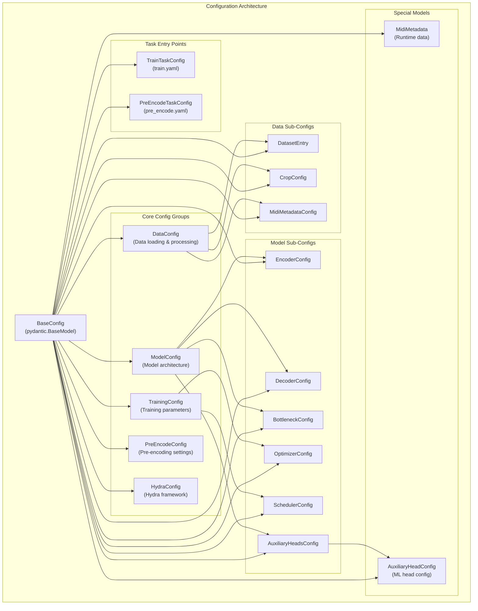
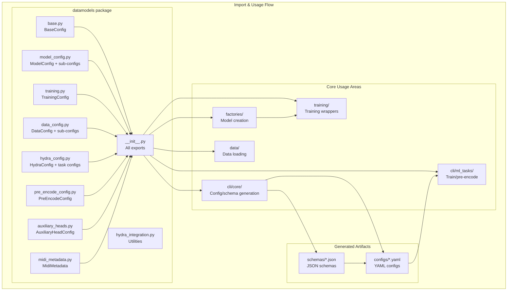
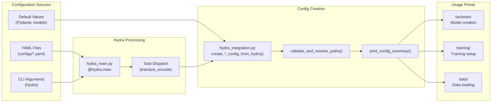
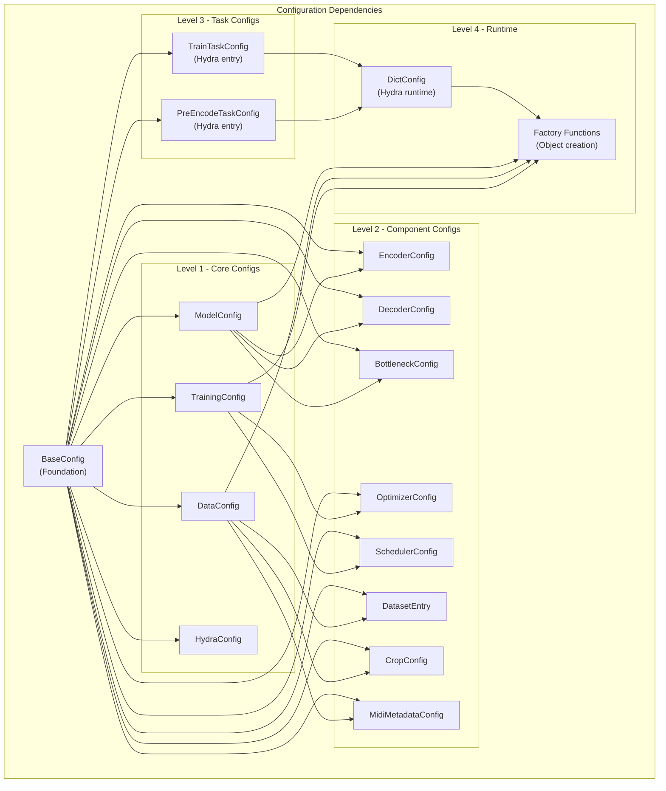

# Audio Hyperencoder Architecture Analysis

## Executive Summary

This document provides a comprehensive analysis of the audio-hyperencoder project's architecture, with a focus on pydantic dataclass usage, configuration management, and architectural patterns. The analysis is intended to support major refactoring efforts.

## Project Overview

The audio-hyperencoder project implements a sophisticated pydantic-based configuration system that serves as a **single source of truth** for all configuration management. The architecture is built around:

- **Pydantic BaseModel** as the foundation for all configuration
- **Hydra framework** for YAML-based configuration management
- **Factory pattern** for object creation from configurations
- **Automatic schema generation** for IDE support and validation
- **Type safety** throughout the configuration pipeline

## Architecture Diagrams

### Core Configuration Architecture



### Import & Usage Flow



### Configuration Flow Architecture



### Configuration Dependencies Map



## Detailed Analysis

### Core Architecture Components

| **Component** | **File Location** | **Base Class** | **Purpose** | **Key Features** |
|---|---|---|---|---|
| `BaseConfig` | `datamodels/base.py` | `pydantic.BaseModel` | Foundation for all configs | ConfigDict, YAML I/O, validation |
| `ModelConfig` | `datamodels/model_config.py` | `BaseConfig` | Model architecture definition | Nested configs, field validation |
| `TrainingConfig` | `datamodels/training.py` | `BaseConfig` | Training parameters | Optimizer configs, validation |
| `DataConfig` | `datamodels/data_config.py` | `BaseConfig` | Data loading & processing | Dataset entries, MIDI metadata |
| `HydraConfig` | `datamodels/hydra_config.py` | `BaseConfig` | Hydra framework integration | Task configs, run settings |
| `PreEncodeConfig` | `datamodels/pre_encode_config.py` | `BaseConfig` | Pre-encoding settings | Batch processing, output paths |

### Model Hierarchy & Relationships

| **Parent Config** | **Child Configs** | **Relationship Type** | **Usage Pattern** |
|---|---|---|---|
| `ModelConfig` | `EncoderConfig`, `DecoderConfig`, `BottleneckConfig` | Composition | Architecture definition |
| `ModelConfig` | `AuxiliaryHeadsConfig`, `DemoConfig` | Composition | Optional features |
| `TrainingConfig` | `OptimizerConfig`, `SchedulerConfig` | Composition | Training optimization |
| `DataConfig` | `DatasetEntry`, `CropConfig`, `MidiMetadataConfig` | Composition | Data processing |
| `AuxiliaryHeadsConfig` | `AuxiliaryHeadConfig` (list) | Collection | Multi-task learning |
| `OptimizerSchedulerConfig` | `OptimizerConfig`, `SchedulerConfig` | Composition | Combined optimization |

### Import Relationships & Dependencies

| **Module** | **Imports From datamodels** | **Usage Context** | **Key Methods** |
|---|---|---|---|
| `hyperencoder/factories/model_factory.py` | `ModelConfig` | Model instantiation | `create_hyperencoder_from_config()` |
| `hyperencoder/training/hyperencoder.py` | `ModelConfig`, `TrainingConfig`, `DemoConfig` | Training wrapper | `create_he_training_wrapper_from_config()` |
| `hyperencoder/cli/core/config_generation.py` | All configs | YAML generation | `generate_all_configs()` |
| `hyperencoder/cli/core/schema_generation.py` | All configs | JSON schema generation | `generate_all_schemas()` |
| `hyperencoder/data/latent.py` | `MidiMetadataConfig`, `MidiMetadata` | Data loading | `model_dump()` |
| `hyperencoder/data/utils.py` | `DataConfig`, `DatasetEntry` | Data processing | `model_dump()` |

### Pydantic Feature Usage Patterns

| **Feature** | **Usage** | **Examples** | **Files** |
|---|---|---|---|
| `Field()` with validation | Type constraints, descriptions | `ge=1`, `le=512`, `description="..."` | All config files |
| `field_validator()` | Custom validation logic | Path resolution, list validation | `data_config.py`, `model_config.py` |
| `model_dump()` | Serialization to dict | Interface with external libraries | `model_factory.py`, `training.py` |
| `ConfigDict` | Model configuration | `extra="forbid"`, `validate_assignment=True` | `base.py` |
| `Field(default_factory=...)` | Complex defaults | Nested config objects | `model_config.py`, `hydra_config.py` |
| `Union` types | Optional configs | `TrainingConfig \| None` | `model_config.py` |
| `Literal` types | Enum-like values | `Literal["auto", "manual", "none"]` | `data_config.py` |

### Critical Usage Patterns & Refactoring Insights

| **Pattern** | **Current Implementation** | **Files Involved** | **Refactoring Considerations** |
|---|---|---|---|
| **Config-to-Dict Conversion** | `model_dump()` used extensively | `model_factory.py`, `training.py` | Consider direct config passing vs dict conversion |
| **Nested Config Creation** | Factory pattern with composition | `ModelConfig` → `EncoderConfig` etc. | Potential for config builder pattern |
| **Hydra Integration** | Custom conversion functions | `hydra_integration.py` | Could be streamlined with better pydantic-hydra integration |
| **Schema Generation** | Manual list maintenance | `schema_generation.py` | Auto-discovery of config classes |
| **Path Resolution** | Custom validators | `data_config.py`, `hydra_config.py` | Centralized path handling utility |
| **Default Value Extraction** | Accessing `.model_fields` | `training.py` | Better default value management |

## Key Architectural Strengths

1. **Single Source of Truth**: All configuration is centralized in pydantic models
2. **Type Safety**: Full type checking and validation throughout the system
3. **Auto-Documentation**: JSON schema generation provides IDE support and validation
4. **Hydra Integration**: Seamless YAML-based configuration management
5. **Extensibility**: Easy to add new configuration options with validation
6. **Composition Pattern**: Clear separation between different configuration concerns
7. **Factory Pattern**: Clean separation between configuration and object creation

## Potential Refactoring Opportunities

### High Priority Issues

| **Area** | **Issue** | **Suggested Improvement** | **Impact** |
|---|---|---|---|
| **Config Class Discovery** | Manual maintenance of config lists | Auto-discovery using `BaseConfig` subclasses | Reduces maintenance burden |
| **Model Factory Pattern** | Repetitive `model_dump()` calls | Direct config object passing | Cleaner interfaces |
| **Path Resolution** | Scattered across multiple validators | Centralized path resolver utility | Consistency and maintainability |
| **Default Value Access** | Direct field access (`model_fields`) | Dedicated default value API | Better encapsulation |

### Medium Priority Issues

| **Area** | **Issue** | **Suggested Improvement** | **Impact** |
|---|---|---|---|
| **Config Validation** | Some validation scattered | Centralized validation pipeline | Better error handling |
| **Hydra Conversion** | Custom conversion functions | Streamlined pydantic-hydra bridge | Reduced boilerplate |
| **Import Optimization** | Potential circular imports | Reorganized import structure | Better maintainability |
| **Schema Generation** | Manual config class management | Automatic discovery and generation | Reduced manual maintenance |

## Critical Files for Refactoring

### Priority 1 - Foundation & Core Logic

1. **`hyperencoder/datamodels/__init__.py`** (76 lines)
   - Central export point, affects all imports
   - Controls the public API of the datamodels package
   - Any changes here propagate throughout the codebase

2. **`hyperencoder/datamodels/base.py`** (72 lines)
   - Foundation class, changes affect everything
   - Contains core configuration patterns (ConfigDict, YAML I/O)
   - Key methods: `to_dict()`, `from_dict()`, `save_yaml()`, `from_yaml()`

3. **`hyperencoder/datamodels/model_config.py`** (430 lines)
   - Largest config file, complex validation logic
   - Contains multiple nested configuration classes
   - Heavy use of field validators and composition patterns

### Priority 2 - Usage & Integration

4. **`hyperencoder/factories/model_factory.py`** (122 lines)
   - Heavy usage of `model_dump()` for config-to-dict conversion
   - Central point for model creation from configurations
   - Key functions: `create_hyperencoder_from_config()`, `create_hyperencoder()`

5. **`hyperencoder/training/hyperencoder.py`** (Large file)
   - Complex config-to-training-wrapper logic
   - Multiple configuration objects used together
   - Key functions: `create_he_training_wrapper_from_config()`

6. **`hyperencoder/cli/core/config_generation.py`** (265+ lines)
   - Schema generation and config discovery
   - Manual maintenance of config class lists
   - Key functions: `generate_all_configs()`, `get_config_definitions()`

### Priority 3 - Data & Integration

7. **`hyperencoder/datamodels/hydra_config.py`** (282 lines)
   - Complex Hydra integration patterns
   - Multiple task configuration classes
   - Potential for simplification

8. **`hyperencoder/datamodels/data_config.py`** (271 lines)
   - Complex data processing configuration
   - Multiple field validators for path resolution
   - Key for data pipeline configuration

## Specific Refactoring Recommendations

### 1. Config Class Auto-Discovery

**Current State**: Manual lists in `schema_generation.py`
```python
# Manual maintenance required
return [
    (BaseConfig, "base_config.schema.json"),
    (TrainingConfig, "training_config.schema.json"),
    # ... more entries
]
```

**Recommended Approach**: Use introspection
```python
def get_config_classes() -> list[tuple[type[BaseConfig], str]]:
    """Auto-discover all BaseConfig subclasses."""
    # Implementation using __subclasses__() or pkgutil
```

### 2. Factory Pattern Optimization

**Current State**: Heavy use of `model_dump()`
```python
encoder = create_encoder_from_config(config.encoder.model_dump())
decoder = create_decoder_from_config(config.decoder.model_dump())
```

**Recommended Approach**: Direct config passing
```python
encoder = create_encoder_from_config(config.encoder)
decoder = create_decoder_from_config(config.decoder)
```

### 3. Path Resolution Centralization

**Current State**: Scattered validators
```python
@field_validator("path", "cache_dir", mode="before")
@classmethod
def resolve_paths(cls, v):
    # Path resolution logic repeated
```

**Recommended Approach**: Centralized utility
```python
from hyperencoder.utils.paths import resolve_config_path

@field_validator("path", mode="before")
@classmethod
def resolve_path(cls, v):
    return resolve_config_path(v)
```

### 4. Default Value Management

**Current State**: Direct field access
```python
_DEFAULT_LEARNING_RATE = TrainingConfig.model_fields['learning_rate'].default
```

**Recommended Approach**: Dedicated API
```python
_DEFAULT_LEARNING_RATE = TrainingConfig.get_default('learning_rate')
```

## Implementation Strategy

### Phase 1: Foundation (Low Risk)
1. Implement config class auto-discovery
2. Add centralized path resolution utility
3. Create better default value access API
4. Update documentation and type hints

### Phase 2: Pattern Optimization (Medium Risk)
1. Optimize factory pattern to use direct config passing
2. Consolidate validation logic
3. Streamline Hydra integration
4. Update import structure

### Phase 3: Advanced Refactoring (High Risk)
1. Potentially restructure config hierarchy
2. Optimize performance bottlenecks
3. Add advanced validation features
4. Consider breaking changes if beneficial

## Testing Strategy

### Critical Test Areas
1. **Config Validation**: Test all field validators and constraints
2. **Serialization**: Test `model_dump()` and YAML I/O
3. **Factory Functions**: Test model creation from configs
4. **Hydra Integration**: Test config loading from YAML
5. **Schema Generation**: Test automatic schema creation
6. **Path Resolution**: Test path handling across different environments

### Regression Testing
- Ensure all existing YAML configs still validate
- Verify all factory functions still work
- Test CLI commands still function
- Validate training and pre-encoding workflows

## Conclusion

The audio-hyperencoder project has a well-architected configuration system built on solid pydantic foundations. The main opportunities for improvement lie in:

1. **Reducing boilerplate** through better patterns
2. **Centralizing common logic** like path resolution
3. **Automating maintenance tasks** like config discovery
4. **Optimizing performance** in factory patterns

The refactoring should proceed incrementally, starting with low-risk improvements to the foundation and gradually moving to more complex optimizations. The type safety and validation provided by pydantic should be preserved and enhanced throughout the process.

This analysis provides a comprehensive roadmap for systematic refactoring while maintaining the architectural strengths of the current system. 